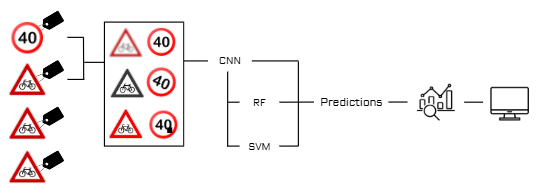

# 8INF867 - Projet FAA

#### Travail réalisé par ALONSO Caroline (ALOC18620100), BAUDOUIN Romain (BAUR25120100) & VAN HYLCKAMA Pedro (VANP15110101)

Les rendus attendus sont tels que suivant :
- Le rapport du projet correspond au fichier : 8INF867_Rapport_Alonso_Baudouin_Hyclkama.pdf
- Le code source annoté correspond au fichier : 8INF867_Projet.ipynb
- Le code source de l'interface correspond au fichier : interface.py 
- L'évaluation des pairs a été rendue sur Moodle
- La présentation a été faite en classe

Notre projet peut se résumer via le schéma suivant : 

